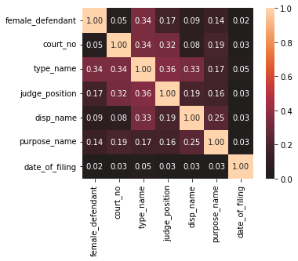
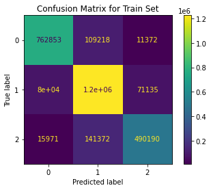
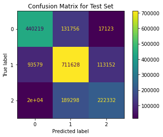

# Directory Structure
```
📦Precog
 ┣ 📂Analysis
 ┃ ┣ 📂Plots
 ┃ ┃ ┣ 📂AnnualGrowth
 ┃ ┃ ┃ ┣ chhattisgarh_annual.png
 ┃ ┃ ┃ ┣ ladakh_annual.png
 ┃ ┃ ┃ ┣ manipur_annual.png
 ┃ ┃ ┃ ┣ sikkim_annual.png
 ┃ ┃ ┃ ┗ statewise_aagr.png
 ┃ ┃ ┣ 📂CriminalCases
 ┃ ┃ ┃ ┣ bottom7.png
 ┃ ┃ ┃ ┣ state.png
 ┃ ┃ ┃ ┣ statewise.png
 ┃ ┃ ┃ ┣ statewise_count.png
 ┃ ┃ ┃ ┣ statewise_percentage.png
 ┃ ┃ ┃ ┗ top7.png
 ┃ ┃ ┣ 📂Gender
 ┃ ┃ ┃ ┣ defendant_female_percentage_statewise.png
 ┃ ┃ ┃ ┗ judges_female_percentage.png
 ┃ ┃ ┣ 📂MonthlyGrowth
 ┃ ┃ ┃ ┣ chhattisgarh_monthly.png
 ┃ ┃ ┃ ┣ meghalaya_monthly.png
 ┃ ┃ ┃ ┣ sikkim_monthly.png
 ┃ ┃ ┃ ┗ statewise_amgr.png
 ┃ ┃ ┗ 📂TypeName
 ┃ ┃ ┃ ┣ female_defendant.png
 ┃ ┃ ┃ ┣ female_defendant_advocate.png
 ┃ ┃ ┃ ┣ male_defendant.png
 ┃ ┃ ┃ ┗ male_defendant_advocate.png
 ┃ ┗ precog-analysis.ipynb
 ┣ 📂Classification
 ┃ ┣ 📂Plots
 ┃ ┃ ┣ confusion_matrix_test.png
 ┃ ┃ ┣ confusion_matrix_train.png
 ┃ ┃ ┗ correlation_matrix.png
 ┃ ┗ precog-classification.ipynb
 ┗ README.md
```
# Code Base
The code base consists of 2 jupyter notebooks, one for analysis and one for classification. All the necessary explanations for the code are given inside the notebooks itself.
## Analysis
This notebook consists of 3 main sections:
1. Reading the Data: 
    - Here we read all the main data required for the task. Some other small data is read in later sections as required.
2. Assessing the Data:
    - In this section, we check the data for any invalid values in any of the fields and observe which columns have Null values and so on.
    - We also correct all invalid data by replacing it with NaN.
3. Exploration:
    - This is the main section which contains all the insights and plots.

## Classification
This notebook consists of n parts:
1. Reading the Data:
    - Read all the data required.
2. Preprocessing:
    - Remove rows with invalid/Null values in the columns of interest.
    - Calculate and add required columns.
3. Splitting the Data:
    - Select features to train the model on.
    - Split the data into 2 parts: one for training the model, and one for testing the model.
    - Look at the correlation matrix of the features and drop some features in case of high correlation.
4. Training Models:
    - Train the data on different models.
    - Make predictions using this model.
5. Performance Measures:
    - Use the predictions to measure the accuracy of the model.
    - Plot a confusion matrix to evaluate the performance of our model.

# Dependency Libraries Used
1. pandas
    - All information processing, from reading data to querying it is done using pandas.
2. sklearn
    - For ML models and their performance measures.
    - For splitting data.
3. matplotlib
    - Used for plotting graphs.
4. datetime
    - Used for doing calculation involving dates.
5. numpy
    - Mainly used for np.NaN values.

# Approach
## Analysis
One obvious thing that I realised was that we cannot read too much data at once and store it because that will lead us to run out of memory.
So I decided to read the case data of one year at a time and do analysis on it. 

In a later section, I have analysed the growth of number of cases over the years for each state. To do this, I read the data for 1 year, extracted the information of each state from it and then deleted it from memory. This solved the memory problem for me.

To find insights, I first starting randomly querying the data and trying to find invalid and missing data in the various columns and corrected them. I studied the metadata provided carefully and thought of columns that I can group by and the metrics that I can use to rank the data. There was a lot of trial and error involved as many of the times, the columns had so much missing or invalid data that we weren't left with enough rows to do analysis on.

Finally, after I thought of a possible grouping or sorting, I queried it and looked at some statistics such as count, mean, median etc. and tried out different plots to visualise it. It was only after plotting the data that I could clearly identify outliers and irregularities.

## Classification
### Choosing a Category
Thinking of a category to classify the data on was very difficult as there was no clearly meaningful category that one could choose.

The only columns which should logically be unavailable on the filing of a case were date_of_decision, date_first_list, date_last_list, date_next_list.

The only column which would be useful practically would be date_of_decision. So I decided to classify based on the `closing time` of cases defined as follows: 
<center>closing time = days between the date_of_filing and date_of_decision</center>

But this would have become a regression problem so I needed a way to convert it into a classification problem.

How I decided to go about this, was by making categories based on the closing time and categorising the data based on this metric.
I defined the following categories:
|Closing Time          | Category | 
|--                    | --       |
|< 6 months            | 1        |
|6 months <=, < 3 years| 2        |
|>=3 years             | 3        |

### Preparing the Data
The features that I chose for training the model were:
``` 
['female_defendant', 'court_no', 'type_name', 'judge_position', 
 'disp_name', 'purpose_name','date_of_filing']
```
I split the data for training and testing in the ratio of 3:2 (60% for training and 40% for testing).

After this I tested the columns for linear dependance by plotting a correlation matrix and dropping columns if they show high correlation among themselves. In my case, there weren't any redundant columns and therefore there was no requirement to drop any column.

 

### Training the Model
I trained the data on 6 classification models from the sklearn library:
```
LogisticRegression
DecisionTreeClassifier
KNeighborsClassifier
LinearDiscriminantAnalysis
GaussianNB
RandomForestClassifier
```

I made the predictions on both the training set and the test set and stored them for assessing the accuraccy later.

### Assessing the Model
I used 2 metrics to assess the quality of my model: accuracy and confusion matrix.

The accuracy of the models is as follows:
| Model Used | Accuracy on Training Set | Accuracy on Test Set |
| ---------- | ------------------------ | -------------------- |
|LogisticRegression        | 0.473 | 0.473 |
|DecisionTreeClassifier    | 0.936 | 0.688 |
|KNeighborsClassifier      | 0.764 | 0.671 |
|LinearDiscriminantAnalysis| 0.475 | 0.476 |
|GaussianNB                | 0.483 | 0.483 |
|RandomForestClassifier 10 trees |0.922 | 0.703 |
|RandomForestClassifier 20 trees |0.932 | 0.707 |
|RandomForestClassifier 500 trees| 0.505 | 0.505 |
|RandomForestClassifier 100 trees| 0.508 | 0.508 |

Plotting the confusion matrix can help us visualise the accuracy of the model and also the distribution of the categorical data.
<center>


</center>
<center>

 

</center>

As we can see the diagonal is more prominent than other entries which indicates a good result.

We can also see that category 2 is the most common category.